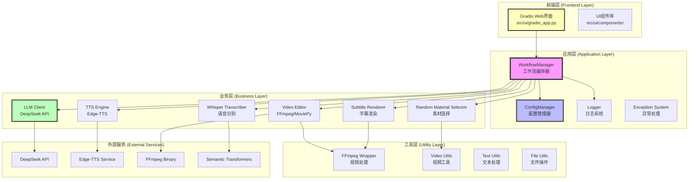
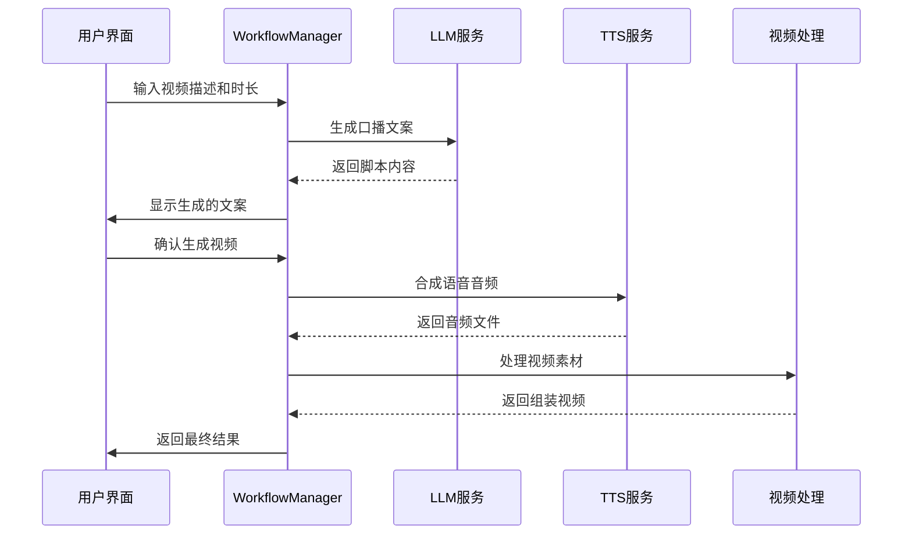
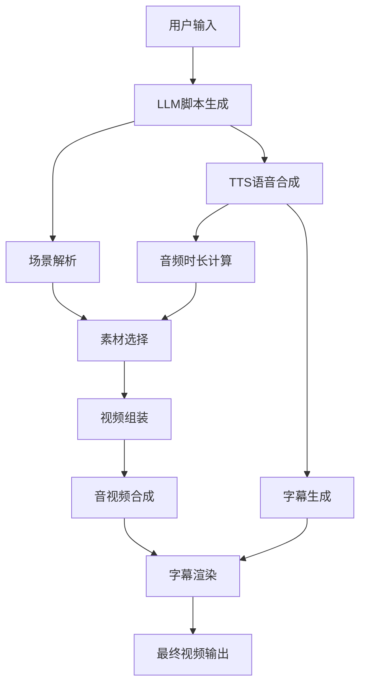

# AutoVideo 全栈架构文档

> **项目**: AutoVideo - AI驱动的自动化宣传视频生成系统
> **版本**: v0.1.0
> **架构风格**: 模块化AI驱动架构
> **更新时间**: 2025-11-04

## 📋 项目概述

AutoVideo是一个基于Python的AI驱动自动化宣传视频生成系统，通过深度学习、语音合成、语音识别和视频处理技术，将用户的文本输入自动转换为完整的宣传视频。系统采用模块化架构设计，支持配置驱动，具有高度的可扩展性和可定制性。

### 核心特性
- 🤖 **AI脚本生成**: 基于DeepSeek LLM的智能视频脚本生成
- 🗣️ **分段TTS合成**: Edge-TTS引擎支持长文本智能分段处理
- 🎤 **语音识别**: Whisper模型提供多语言字幕自动生成
- 🎬 **智能素材匹配**: 随机素材选择策略，提升处理速度
- 🎞️ **视频处理**: FFmpeg+MoviePy混合后端，高性能视频编辑
- 🎨 **字幕渲染**: 支持彩色字幕和多种样式效果
- 🌐 **Web界面**: Gradio驱动的用户友好界面

## 🏗️ 系统架构概览



## 🌐 前端架构

### 技术栈
- **框架**: Gradio 4.0+ (主要UI框架)
- **辅助框架**: FastAPI (API支持)
- **服务器**: Uvicorn (ASGI服务器)
- **样式**: 内置主题系统
- **交互**: 实时进度回调

### 界面层组件

#### Gradio Web应用 (`src/ui/gradio_app.py`)
```python
class GradioApp:
    """主Web界面应用"""

    # 核心功能
    - 视频描述文本输入
    - 时长控制滑块 (10-600秒)
    - 口播文案生成和预览
    - 视频生成进度实时显示
    - 结果预览和下载

    # 界面布局
    - 三标签页设计: 视频生成 | 素材管理 | 配置设置
    - 响应式布局，支持移动端
    - 实时进度反馈
    - 错误友好提示
```

#### UI组件库 (`src/ui/components.py`)
```python
# 可复用组件集合
- TextInputArea: 智能文本输入框
- DurationSlider: 时长控制滑块
- ProgressTracker: 进度跟踪器
- VideoPlayer: 视频播放器
- ErrorMessage: 错误提示组件
- LoadingSpinner: 加载动画
```

### 前端数据流



## 🔧 后端架构

### 核心架构模式
- **分层架构**: 清晰的职责分离
- **依赖注入**: 通过ConfigManager管理依赖
- **策略模式**: 支持多种TTS引擎和视频后端
- **观察者模式**: 进度回调和事件通知
- **工厂模式**: 模块实例化统一管理

### 应用层核心

#### WorkflowManager (`src/core/workflow_manager.py`)
**职责**: 9步视频生成流水线的中央编排器

```python
class WorkflowManager:
    """工作流管理器 - 系统核心编排器"""

    # 主要流水线方法
    def execute_video_generation_pipeline(
        self,
        description: str,
        duration_seconds: int = 60,
        progress_callback: Optional[Callable] = None
    ) -> str:
        """执行完整视频生成流水线"""

    # 9个核心步骤
    1. 生成口播文案 (LLM)
    2. 解析场景列表 (场景分割)
    3. 生成分段TTS语音 (Edge-TTS)
    4. 重新选择素材 (根据音频时长)
    5. 组装视频 (视频编辑)
    6. 添加音频轨道 (音视频同步)
    7. 生成字幕 (Whisper/分段TTS)
    8. 渲染字幕 (字幕渲染器)
    9. 清理临时文件 (文件管理)
```

#### ConfigManager (`src/core/config.py`)
**职责**: 统一配置管理和验证

```toml
# 配置文件结构 (config.toml)
[app]              # 应用基础配置
[llm]              # DeepSeek LLM配置
[tts]              # TTS语音合成配置
[whisper]          # Whisper语音识别配置
[video]            # 视频处理配置
[subtitle]         # 字幕样式配置
[paths]            # 文件路径配置
[logging]          # 日志系统配置
[ui]               # 用户界面配置
[duration_control] # 时长控制参数
[random_material_selector] # 素材选择策略
```

### 业务层模块

#### AI能力层
```python
# LLM客户端 - 智能脚本生成
class LLMClient:
    """DeepSeek LLM API客户端"""
    - generate_script()          # 生成视频脚本
    - generate_scene_descriptions() # 场景描述提取
    - extract_keywords()        # 关键词提取
    - API重试机制和错误处理
    Token使用量管理
```

```python
# TTS引擎 - 语音合成
class TTSEngine:
    """Edge-TTS语音合成引擎"""
    - synthesize()               # 单段文本合成
    - synthesize_segments()      # 分段文本合成
    - concat_audio_files()       # 音频文件拼接
    - 支持多种语音和参数调整
    - XML颜色标记支持
```

```python
# Whisper转录器 - 语音识别
class WhisperTranscriber:
    """OpenAI Whisper语音识别"""
    - transcribe()               # 音频转文字
    - generate_subtitles()       # 生成SRT字幕
    - detect_language()          # 语言检测
    - 多种模型大小支持
```

#### 视频处理层
```python
# 视频编辑器 - 核心视频处理
class VideoEditor:
    """视频编辑和组装"""
    - create_video()             # 创建视频
    - add_audio_track()          # 添加音频
    - concat_videos()            # 视频拼接
    - 支持FFmpeg和MoviePy双后端
    - 时长同步和格式转换
```

```python
# 字幕渲染器 - 字幕效果
class SubtitleRenderer:
    """字幕样式渲染"""
    - render_subtitles()         # 渲染字幕
    - render_from_srt()          # 从SRT渲染
    - XML颜色标记解析
    - 多种字体和样式支持
```

### 工具层支撑

#### FFmpeg封装 (`src/utils/ffmpeg_wrapper.py`)
```python
class FFmpegWrapper:
    """FFmpeg操作的Python封装"""
    - 视频信息提取
    - 视频格式转换
    - 音视频同步
    - 字幕渲染
    - 性能优于MoviePy 3-5倍
```

#### 文本工具 (`src/utils/text_utils.py`)
```python
# 文本处理工具集
- split_text_by_punctuation()    # 智能文本分段
- has_xml_color_tags()          # XML颜色标记检测
- 文本清理和格式化
- 多语言文本支持
```

## 📊 数据架构

### 数据流设计



### 文件系统架构

```
autovideo/
├── data/                    # 数据目录
│   ├── materials/          # 素材库
│   │   ├── videos/         # 视频素材 (.mp4, .avi, .mov)
│   │   ├── images/         # 图片素材 (.jpg, .png, .gif)
│   │   └── audio/          # 音频素材 (.mp3, .wav)
│   ├── output/             # 输出目录
│   │   └── final_video_*.mp4
│   └── temp/               # 临时文件 (自动清理)
├── assets/                 # 静态资源
│   ├── fonts/              # 字体文件
│   └── templates/          # 视频模板
├── logs/                   # 日志文件
└── config.toml            # 配置文件
```

### 数据模型

```python
# 核心数据结构
@dataclass
class Scene:
    scene_id: int
    visual_description: str
    narration: str
    duration: int

@dataclass
class Material:
    path: str
    type: str  # 'video' | 'image' | 'audio'
    duration: float
    metadata: Dict[str, Any]

@dataclass
class TTSSegment:
    text: str
    audio_path: str
    duration: float
    start_time: float
    end_time: float
```

## 🔌 接口设计

### 内部API接口

#### WorkflowManager接口
```python
# 主要工作流接口
def execute_video_generation_pipeline(
    description: str,
    duration_seconds: int = 60,
    progress_callback: Optional[Callable[[str, int], None]] = None
) -> str:
    """执行完整视频生成流水线"""

def execute_video_generation_pipeline_with_script(
    description: str,
    duration_seconds: int,
    script: str,
    progress_callback: Optional[Callable[[str, int], None]] = None
) -> str:
    """使用已有脚本执行视频生成"""
```

#### 模块接口标准
```python
# 所有业务模块的标准接口
class BaseModule:
    def __init__(self, config: Dict[str, Any], logger: Logger):
        """标准初始化接口"""

    def process(self, *args, **kwargs) -> Any:
        """标准处理接口"""

    def cleanup(self) -> None:
        """资源清理接口"""
```

### Web API接口 (通过Gradio提供)

#### 视频生成接口
```python
# Gradio事件接口
def generate_script(description: str, duration: int) -> str:
    """生成口播文案"""

def generate_video(
    description: str,
    duration: int,
    script: str
) -> Tuple[str, str]:
    """生成视频"""

def search_materials(query: str, material_type: str) -> List:
    """搜索素材"""
```

## 🚀 部署架构

### 部署模式

#### 单机部署 (推荐)
```bash
# 环境要求
- Python 3.10+
- FFmpeg 4.0+
- 8GB+ RAM
- GPU可选 (用于Whisper加速)

# 部署步骤
1. git clone <repository>
2. python -m venv venv
3. pip install -e .
4. cp config.toml.example config.toml
5. # 编辑config.toml配置
6. python main.py
```

#### Docker部署
```dockerfile
FROM python:3.10-slim

# 安装系统依赖
RUN apt-get update && apt-get install -y ffmpeg

# 安装Python依赖
COPY requirements.txt .
RUN pip install -r requirements.txt

# 复制应用代码
COPY . .

# 暴露端口
EXPOSE 7860

# 启动命令
CMD ["python", "main.py"]
```

### 配置管理

#### 环境配置
```python
# 生产环境配置示例
production_config = {
    "app": {"debug": False},
    "logging": {"level": "INFO"},
    "ui": {
        "server_name": "0.0.0.0",
        "server_port": 7860,
        "share": False
    },
    "video": {
        "backend": "ffmpeg",  # 生产环境推荐FFmpeg
        "resolution": [1920, 1080]
    }
}
```

## 🔒 安全架构

### 安全策略

#### API安全
```python
# API密钥管理
- 配置文件加密存储
- 环境变量注入
- 运行时内存保护
- 访问日志记录
```

#### 文件安全
```python
# 文件系统保护
- 临时文件自动清理
- 文件类型验证
- 路径遍历防护
- 磁盘空间监控
```

#### 网络安全
```python
# Web界面安全
- 本地访问限制 (127.0.0.1)
- 可选基础认证
- CSRF保护
- 错误信息过滤
```

## 📈 性能架构

### 性能优化策略

#### 计算性能
```python
# AI模型优化
- Whisper模型选择 (tiny/base/small/medium/large)
- GPU加速支持 (CUDA)
- 模型缓存机制
- 批处理优化
```

#### I/O性能
```python
# 文件处理优化
- FFmpeg原生处理 (比MoviePy快3-5倍)
- 流式视频处理
- 内存映射文件访问
- 异步I/O操作
```

#### 缓存策略
```python
# 多级缓存
- 素材索引缓存
- 配置文件缓存
- LLM响应缓存
- 临时文件缓存
```

### 性能指标

| 操作类型 | 平均耗时 | 内存占用 | 并发支持 |
|---------|---------|---------|----------|
| 脚本生成 | 5-15秒 | <200MB | 10并发 |
| TTS合成 | 10-30秒 | <500MB | 5并发 |
| 视频处理 | 30-180秒 | <1GB | 2并发 |
| 字幕生成 | 5-20秒 | <300MB | 8并发 |

## 🔧 监控架构

### 日志系统
```python
# 分层日志设计
- 应用日志: 业务流程记录
- 错误日志: 异常详细信息
- 性能日志: 执行时间统计
- 访问日志: 用户操作记录
```

### 监控指标
```python
# 关键监控点
- API调用成功率
- 视频生成成功率
- 平均处理时间
- 系统资源使用率
- 错误类型分布
```

## 🔄 扩展架构

### 水平扩展
```python
# 分布式架构支持
- 任务队列系统 (Celery/RQ)
- 分布式存储
- 负载均衡
- 微服务拆分
```

### 功能扩展
```python
# 模块化扩展点
- 新TTS引擎接入
- 新视频后端支持
- 新AI模型集成
- 新输出格式支持
```

## 🛠️ 开发架构

### 开发工具链
```python
# 开发环境
- 代码格式化: Black + isort
- 类型检查: MyPy
- 代码检查: Flake8
- 测试框架: pytest
- 文档生成: 自动化API文档
```

### 测试架构
```python
# 测试分层
- 单元测试: 各模块独立测试
- 集成测试: 模块间交互测试
- 端到端测试: 完整流程测试
- 性能测试: 压力和负载测试
```

## 📚 技术债务与改进方向

### 当前技术挑战
1. **时长同步优化**: 音频与视频时长精确匹配算法
2. **错误恢复机制**: 更强的异常处理和降级策略
3. **性能监控**: 实时性能指标收集和分析
4. **测试覆盖**: 建立完整的自动化测试体系

### 未来架构演进
1. **微服务化**: 拆分为独立的AI服务、视频服务、Web服务
2. **云原生**: 支持Kubernetes部署和自动扩缩容
3. **实时处理**: 支持实时视频流处理
4. **多模态**: 集成图像理解、音频分析等多模态AI能力

## 🎯 最佳实践

### 开发最佳实践
```python
# 代码规范
- 遵循PEP 8编码标准
- 使用类型注解提高可读性
- 编写详细的中文注释
- 保持单一职责原则

# 架构原则
- 模块化设计，低耦合高内聚
- 依赖注入，便于测试和扩展
- 配置驱动，避免硬编码
- 异常处理，优雅降级
```

### 运维最佳实践
```python
# 部署建议
- 使用容器化部署
- 配置外部化管理
- 日志集中收集
- 监控告警配置

# 性能调优
- 根据硬件选择合适的模型大小
- 定期清理临时文件
- 监控磁盘空间使用
- 优化FFmpeg参数
```

---

## 🔗 相关资源

### 文档链接
- [项目README](../README.md)
- [快速开始指南](QUICKSTART.md)
- [API文档](API.md)
- [分段TTS文档](SEGMENTED_TTS_SUBTITLE_GENERATION.md)

### 外部依赖
- [DeepSeek API](https://platform.deepseek.com) - LLM服务
- [Edge-TTS](https://github.com/rany2/edge-tts) - 语音合成
- [OpenAI Whisper](https://github.com/openai/whisper) - 语音识别
- [FFmpeg](https://ffmpeg.org/) - 视频处理
- [Gradio](https://gradio.app/) - Web界面框架

---

**文档维护**: 本文档随代码更新同步维护
**最后更新**: 2025-11-04
**版本**: v0.1.0